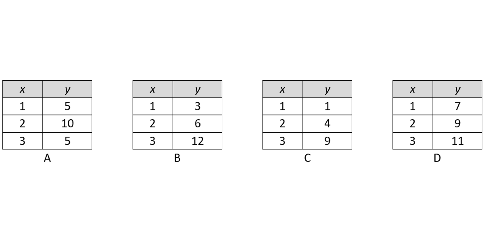
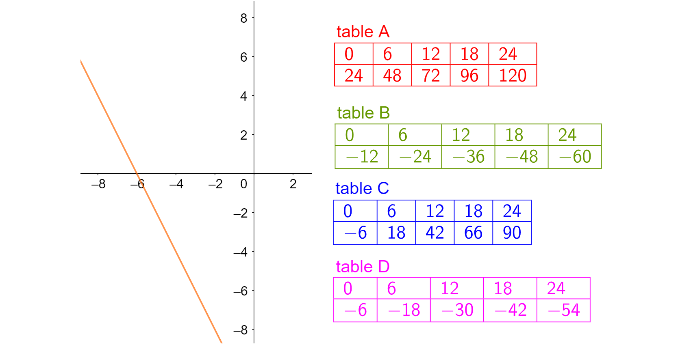

# Question export

## Q004 (ID 0)

* **Learning-goal level:** 1.1

### Locale `nl`

Welke van de volgende formules komt overeen met een lineaire functie?

- **Correct:** y = ax + b
- **Wrong 1:** y = x^2 + b
- **Wrong 2:** y=-4x^2 + b
- **Wrong 3:** y=-sqrt (4x)

_Feedback:_ y = ax + b is juist

### Locale `en`

Which of the following formulas matches with a linear function? 

- **Correct:** y = ax + b
- **Wrong 1:** y = x^2 + b
- **Wrong 2:** y=-4x^2 + b
- **Wrong 3:** y=-4x^2 + b

_Feedback:_ y = ax + b is correct

---

## Q007 (ID 0)

* **Learning-goal level:** 1.1

### Locale `nl`

Welke waarde hoort in het groene vak?

- **Correct:** 16
- **Wrong 1:** 14
- **Wrong 2:** 18
- **Wrong 3:** Geen een

_Feedback:_ Waarde 16 is juist. De veranderingssnelheid is constant en gelijk aan 3 (verschil tussen de y-waarden -2 en -11 gedeeld door het verschil tussen de overeenkomstige x-waarden 1 en -4). Het verschil tussen de x-waarden 5 en -1 is 6 en omdat de snelheid 3 is, weet je dat het verschil tussen hun corresponderende y-waarden 3 keer hun verschil moet zijn (3x6=18). Om de y-waarde voor x=5 te berekenen tel je 18 op bij de y-waarde voor x=-1. Dat is -2+18=16.

### Locale `en`

What value goes in the green space?

- **Correct:** 16
- **Wrong 1:** 14
- **Wrong 2:** 18
- **Wrong 3:** None of them

_Feedback:_ Value 16 is correct. The rate of change is constante and equal to 3 (diference between the y-values -2 and -11 divided by the difference between the correspondent x-values 1 and -4). The difference between the x-values 5 and -1 is 6 and because the rate is 3 you know that the difference between their correspondent y-values must be 3 times their difference (3x6=18). To calculate the y-value for x=5 you add 18 to the y-value for x=-1. That is -2+18=16.

---

## Q041 (ID 0)

* **Learning-goal level:** 1.1

### Locale `nl`

Welke waarde ontbreekt in de tabel?

- **Correct:** 3
- **Wrong 1:** 4
- **Wrong 2:** 5
- **Wrong 3:** 6

_Feedback:_ Waarde 3 is correct. De veranderingssnelheid is constant en gelijk aan 2 (verschil tussen de y-waarden 1 en -1 gedeeld door het verschil tussen de overeenkomstige x-waarden -1 en -2). Om de y-waarde voor x=0 te berekenen, tel je het tarief 2 op bij de y-waarde voor x=-1. Dat is 1+2=3.

### Locale `en`

What is the missing value in the table?

- **Correct:** 3
- **Wrong 1:** 4
- **Wrong 2:** 5
- **Wrong 3:** 6

_Feedback:_ Value 3 is correct. The rate of change is constante and equal to 2 (diference between the y-values 1 and -1 divided by the difference between the correspondent x-values -1 and -2). To calculate the y-value for x=0 you add the rate 2 to the y-value for x=-1. That is 1+2=3.

---

## Q052 (ID 0)

* **Learning-goal level:** 1.1

### Locale `nl`

Welke van de volgende tabellen stelt een lineaire functie voor?

- **Correct:** D
- **Wrong 1:** A
- **Wrong 2:** B
- **Wrong 3:** C

_Feedback:_ Tabel D is correct omdat de veranderingssnelheid constant is (verschil tussen de y-waarden gedeeld door het verschil tussen de overeenkomstige x-waarden)

### Locale `en`

Which of the following tables represents a linear function?

- **Correct:** D
- **Wrong 1:** A
- **Wrong 2:** B
- **Wrong 3:** C

_Feedback:_ Table D is correct because the rate of change is constante (difference between the y-values divided by the difference between the correspondent x-values)

---

## Q054 (ID 0)

* **Learning-goal level:** 1.1

### Locale `nl`

De figuur toont de eerste vier V-patronen. Elk patroon heeft een nummer. Welk nummer heeft een V-patroon met 17 stippen?

- **Correct:** 8
- **Wrong 1:** 6
- **Wrong 2:** 7
- **Wrong 3:** Er is geen V-patroon met 17 stippen

_Feedback:_ Het moet 8 zijn. De constante veranderingssnelheid is 2 (je voegt altijd 2 punten toe aan elk nieuw patroon). Patroon 1 heeft 3 stippen, patroon 2 heeft 5 stippen en patroon 8 heeft 17 stippen.

### Locale `en`

The figure shows the first four V-patterns. Each pattern has a number. Which number has a V-pattern with 17 dots?

- **Correct:** 8
- **Wrong 1:** 6
- **Wrong 2:** 7
- **Wrong 3:** There is no V-pattern with 17 dots

_Feedback:_ It must be 8. The constante rate of change is 2 (you add always 2 dots to each new pattern). Pattern 1 has 3 dots; pattern 2 has 5 dots;…and pattern 8 has 17 dots.

---

## Q055 (ID 0)

* **Learning-goal level:** 1.1

### Locale `nl`

De figuur toont de eerste vier V-patronen. Elk patroon heeft een nummer. Hoeveel stippen heeft het V-patroon met nummer 85?

- **Correct:** 171
- **Wrong 1:** 169
- **Wrong 2:** 170
- **Wrong 3:** 168

_Feedback:_ Het antwoord is 171. De constante veranderingssnelheid is 2 en het y-snijpunt is 1 (voor patroon nul is er 1 punt). Het hele patroon wordt gegeven door de formule y=2x+1. Voor x=85 dan is y=171

### Locale `en`

The figure shows the first four V-patterns. Each pattern has a number. How many dots has the V-pattern with number 85?

- **Correct:** 171
- **Wrong 1:** 169
- **Wrong 2:** 170
- **Wrong 3:** 168

_Feedback:_ The answer is 171. The constant rate of change is 2 and the y-intercept is 1 (for pattern zero there 1 dot). The whole pattern is given by the formula y=2x+1. For x=85 than is y=171

---

## Q056 (ID 0)

* **Learning-goal level:** 1.1

### Locale `nl`

De figuur toont de eerste drie V-patronen. Elk patroon heeft een nummer. Welk nummer heeft een W-patroon met 21 stippen?

- **Correct:** 5
- **Wrong 1:** 4
- **Wrong 2:** 6
- **Wrong 3:** Er is geen W-patroon met 21 stippen

_Feedback:_ Het moet 5 zijn. De constante veranderingssnelheid is 4 (je voegt altijd 4 stippen toe aan elk nieuw patroon). Patroon 1 heeft 5 stippen, patroon 2 heeft 9 stippen,... en patroon 5 heeft 21 stippen.

### Locale `en`

The figure shows the first three W-patterns. Each pattern has a number. Which number has a W-pattern with 21 dots?

- **Correct:** 5
- **Wrong 1:** 4
- **Wrong 2:** 6
- **Wrong 3:** There is no W-pattern with 21 dots

_Feedback:_ It must be 5. The constante rate of change is 4 (you add always 4 dots to each new pattern). Pattern 1 has 5 dots; pattern 2 has 9 dots;…and pattern 5 has 21 dots.

---

## Q057 (ID 0)

* **Learning-goal level:** 1.1

### Locale `nl`

De figuur toont de eerste drie W-patronen. Elk patroon heeft een nummer. Hoeveel stippen heeft het W-patroon met nummer 25?

- **Correct:** 101
- **Wrong 1:** 99
- **Wrong 2:** 100
- **Wrong 3:** 102

_Feedback:_ Het antwoord is 101. De constante veranderingssnelheid is 4 en het y-snijpunt is 1 (voor patroon nul is er 1 punt). Het hele patroon wordt gegeven door de formule y=4x+1. Voor x=25 dan is y=101

### Locale `en`

The figure shows the first three W-patterns. Each pattern has a number. How many dots has the W-pattern with number 25?

- **Correct:** 101
- **Wrong 1:** 99
- **Wrong 2:** 100
- **Wrong 3:** 102

_Feedback:_ The answer is 101. The constant rate of change is 4 and the y-intercept is 1 (for pattern zero there 1 dot). The whole pattern is given by the formula y=4x+1. For x=25 than is y=101

---

## Q065 (ID 0)

* **Learning-goal level:** 1.2

### Locale `nl`

Welke lijn heeft y-snijpunt 4?

- **Correct:** a
- **Wrong 1:** b
- **Wrong 2:** c
- **Wrong 3:** d

_Feedback:_ a is correct omdat de lijn de y-as met 4 kruist

### Locale `en`

Which line has y-intercept 4?

- **Correct:** a
- **Wrong 1:** b
- **Wrong 2:** c
- **Wrong 3:** d

_Feedback:_ a is correct because the line crosses the y-axis by 4

---

## Q066 (ID 0)

* **Learning-goal level:** 1.2

### Locale `nl`

Welke lijn gaat door punt (0,-4)?

- **Correct:** b
- **Wrong 1:** a
- **Wrong 2:** c
- **Wrong 3:** d

_Feedback:_ b is correct omdat de lijn de x-as met nul kruist en de y-as met -4

### Locale `en`

Which line goes through point (0;-4)?

- **Correct:** b
- **Wrong 1:** a
- **Wrong 2:** c
- **Wrong 3:** d

_Feedback:_ b is correct because the line crosses the x-axis by zero and the y-axis by -4

---

## Q067 (ID 0)

* **Learning-goal level:** 1.2

### Locale `nl`

Welke lijn heeft y-snijpunt 4?

- **Correct:** a
- **Wrong 1:** b
- **Wrong 2:** c
- **Wrong 3:** d

_Feedback:_ a is correct, want als de x-waarde nul is, is de y-waarde 4 (y-snijpunt)

### Locale `en`

Which line has y-intercept 4?

- **Correct:** a
- **Wrong 1:** b
- **Wrong 2:** c
- **Wrong 3:** d

_Feedback:_ a is correct because if the x-value is zero the y-value is 4 (y-intercept)

---

## Q068 (ID 0)

* **Learning-goal level:** 1.2

### Locale `nl`

Welke lijn gaat door punt (0,-4)?

- **Correct:** b
- **Wrong 1:** a
- **Wrong 2:** c
- **Wrong 3:** d

_Feedback:_ b is juist, want als de x-waarde nul is, is de y-waarde - 4

### Locale `en`

Which line goes through point (0;-4)?

- **Correct:** b
- **Wrong 1:** a
- **Wrong 2:** c
- **Wrong 3:** d

_Feedback:_ b is correct because if the x-value is zero the y-value is - 4

---

## Q069 (ID 0)

* **Learning-goal level:** 1.2

### Locale `nl`

Welke lijn heeft y-snijpunt 4?

- **Correct:** Tabel C
- **Wrong 1:** Tabel A
- **Wrong 2:** Tabel B
- **Wrong 3:** Tabel D

_Feedback:_ tabel C is juist omdat voor x=0 de y-waarde 4 is

### Locale `en`

Which line has y-intercept 4?

- **Correct:** Table C
- **Wrong 1:** Table A
- **Wrong 2:** Table B
- **Wrong 3:** Table D

_Feedback:_ table C is correct because for x=0 the y-value is 4

---

## Q070 (ID 0)

* **Learning-goal level:** 1.2

### Locale `nl`

Welke lijn gaat door punt (0,-4)?

- **Correct:** d
- **Wrong 1:** a
- **Wrong 2:** b
- **Wrong 3:** c

_Feedback:_ d is juist omdat voor x=0 de y-waarde -4 is

### Locale `en`

Which line goes through point (0;-4)?

- **Correct:** d
- **Wrong 1:** a
- **Wrong 2:** b
- **Wrong 3:** c

_Feedback:_ d is correct because for x=0 the y-value is -4

---

## Q071 (ID 0)

* **Learning-goal level:** 1.2

### Locale `nl`

Welke lijn heeft het hoogste y-snijpunt?

- **Correct:** a
- **Wrong 1:** b
- **Wrong 2:** c
- **Wrong 3:** d

_Feedback:_ optie a is correct omdat 4 hoger is dan -4, -2 en 2 (dit zijn de andere y-snijpunten)

### Locale `en`

Which line has the highest y-intercept?

- **Correct:** a
- **Wrong 1:** b
- **Wrong 2:** c
- **Wrong 3:** d

_Feedback:_ option a is correct because 4 is higher than -4; -2 and 2 (which are the other y-intercepts)

---

## Q005 (ID 0)

* **Learning-goal level:** 1.3

### Locale `nl`

Welke van de volgende formules komen overeen met een stijgende lineaire functie?

- **Correct:** y = 4x + 3
- **Wrong 1:** y = -4x + 3
- **Wrong 2:** y = -4x - 3
- **Wrong 3:** y = -4x

_Feedback:_ y = 4x + 3 is juist omdat het teken van de helling (getal voor de x) positief is

### Locale `en`

Which of the following formulas matches with an increasing linear function? 

- **Correct:** y = 4x + 3
- **Wrong 1:** y = -4x + 3
- **Wrong 2:** y = -4x - 3
- **Wrong 3:** y = -4x

_Feedback:_ y = 4x + 3 is correct because the sign of the slope (number before the x) is positive

---

## Q006 (ID 0)

* **Learning-goal level:** 1.3

### Locale `nl`

Welke van de volgende formules komen overeen met een afnemende lineaire functie?

- **Correct:** y = -9x + 1
- **Wrong 1:** y = 9x - 1
- **Wrong 2:** y = 9x +1
- **Wrong 3:** y = 9x

_Feedback:_ y = -9x + 1 is juist omdat het teken van de helling (getal voor de x) negatief is

### Locale `en`

Which of the following formulas matches with a decreasing linear function?

- **Correct:** y = -9x + 1
- **Wrong 1:** y = 9x - 1
- **Wrong 2:** y = 9x +1
- **Wrong 3:** y = 9x

_Feedback:_ y = -9x + 1 is correct because the sign of the slope (number before the x) is negative

---

## Q053 (ID 0)

* **Learning-goal level:** 1.3

### Locale `nl`

Welke van deze lijnen heeft een helling van -5?

- **Correct:** c
- **Wrong 1:** a
- **Wrong 2:** b
- **Wrong 3:** d

_Feedback:_ grafiek (c) is correct omdat het teken van de helling negatief is (afnemende grafiek) en groter is (de grafiek is steiler)

### Locale `en`

Which of these lines has slope -5?

- **Correct:** c
- **Wrong 1:** a
- **Wrong 2:** b
- **Wrong 3:** d

_Feedback:_ graph (c) is correct because the sign of slope is negative (decreasing graph) and greater magnitude (the graph is more steep) 

---

## Q018 (ID 0)

* **Learning-goal level:** 1.4

### Locale `nl`

Zie de weg van A naar H. Wat is de helling van het lijnstuk CD?

- **Correct:** Gelijk aan 1
- **Wrong 1:** Kleiner dan 1
- **Wrong 2:** Groter dan 1
- **Wrong 3:** Ik weet het niet

_Feedback:_ gelijk aan 1 is juist. De helling is gelijk aan het verschil tussen de y-waarden gedeeld door het verschil tussen de overeenkomstige x-waarden (bijvoorbeeld 4:4=1)

### Locale `en`

See the road from A to H. What is the slope of the line segment CD?

- **Correct:** Equal to 1
- **Wrong 1:** Less than 1
- **Wrong 2:** Greater than 1
- **Wrong 3:** I don't know

_Feedback:_ equal to 1 is correct. The slope is equal to the diference between the y-values divided by the difference between the correspondent x-values (for instance 4:4=1)

---

## Q058 (ID 0)

* **Learning-goal level:** 1.4

### Locale `nl`

Zie de weg van A naar H. Wat is de helling van lijnstuk AB?

- **Correct:** 2
- **Wrong 1:** 4
- **Wrong 2:** 0.5
- **Wrong 3:** 1

_Feedback:_ 2 is het juiste antwoord omdat het verschil tussen de y-waarden gedeeld door het verschil tussen de overeenkomstige x-waarden 2 is.

### Locale `en`

See the road from A to H. What is the slope of the line segment AB? 

- **Correct:** 2
- **Wrong 1:** 4
- **Wrong 2:** 0.5
- **Wrong 3:** 1

_Feedback:_ 2 is the correct answer because the difference between the y-values divided by the difference between the correspondent x-values is 2.

---

## Q059 (ID 0)

* **Learning-goal level:** 1.4

### Locale `nl`

Zie de weg van A naar H. Wat is de helling van lijnstuk BC?

- **Correct:** -0.5
- **Wrong 1:** -2
- **Wrong 2:** -1
- **Wrong 3:** -3

_Feedback:_ het juiste antwoord is -0,5 omdat het verschil tussen de y-waarden gedeeld door het verschil tussen de overeenkomstige x-waarden -0,5 is.

### Locale `en`

See the road from A to H. What is the slope of the line segment BC?

- **Correct:** -0.5
- **Wrong 1:** -2
- **Wrong 2:** -1
- **Wrong 3:** -3

_Feedback:_ the correct answer is -0.5 because the difference between the y-values divided by the difference between the correspondent x-values is -0.5.

---

## Q060 (ID 0)

* **Learning-goal level:** 1.4

### Locale `nl`

Zie de weg van A naar H. Wat is de helling van lijnstuk DE?

- **Correct:** -1
- **Wrong 1:** -2
- **Wrong 2:** 2
- **Wrong 3:** 1

_Feedback:_ het juiste antwoord is -1 omdat het verschil tussen de y-waarden gedeeld door het verschil tussen de overeenkomstige x-waarden -1 is.

### Locale `en`

See the road from A to H. What is the slope of the line segment DE?

- **Correct:** -1
- **Wrong 1:** -2
- **Wrong 2:** 2
- **Wrong 3:** 1

_Feedback:_ the correct answer is -1 because the difference between the y-values divided by the difference between the correspondent x-values is -1.

---

## Q061 (ID 0)

* **Learning-goal level:** 1.4

### Locale `nl`

Zie de weg van A naar H. Wat is de helling van lijnstuk EF?

- **Correct:** 0
- **Wrong 1:** 1
- **Wrong 2:** -1
- **Wrong 3:** EF heeft geen helling

_Feedback:_ 0 is het juiste antwoord omdat de lijn horizontaal is

### Locale `en`

See the road from A to H. What is the slope of the line segment EF?

- **Correct:** 0
- **Wrong 1:** 1
- **Wrong 2:** -1
- **Wrong 3:** EF doesn't have a slope

_Feedback:_ 0 is the correct answer because the line is horozontal

---

## Q062 (ID 0)

* **Learning-goal level:** 1.4

### Locale `nl`

Zie de weg van A naar H. Wat is de helling van lijnstuk FG?

- **Correct:** 1.5
- **Wrong 1:** 2
- **Wrong 2:** 3
- **Wrong 3:** 2/3

_Feedback:_ 1,5 is het juiste antwoord omdat het verschil tussen de y-waarden gedeeld door het verschil tussen de overeenkomstige x-waarden 1,5 is.

### Locale `en`

See the road from A to H. What is the slope of the line segment FG?

- **Correct:** 1.5
- **Wrong 1:** 2
- **Wrong 2:** 3
- **Wrong 3:** 2/3

_Feedback:_ 1.5 is the correct answer because the difference between the y-values divided by the difference between the correspondent x-values is 1.5.

---

## Q063 (ID 0)

* **Learning-goal level:** 1.4

### Locale `nl`

Zie de weg van A naar H. Wat is de helling van lijnstuk GH?

- **Correct:** 1/3
- **Wrong 1:** 3
- **Wrong 2:** 4
- **Wrong 3:** 0.5

_Feedback:_ 1/3 is het juiste antwoord omdat het verschil tussen de y-waarden gedeeld door het verschil tussen de corresponderende x-waarden 1/3 is

### Locale `en`

See the road from A to H. What is the slope of the line segment GH?

- **Correct:** 1/3
- **Wrong 1:** 3
- **Wrong 2:** 4
- **Wrong 3:** 0.5

_Feedback:_ 1/3 is the correct answer because the difference between the y-values divided by the difference between the correspondent x-values is 1/3

---

## Q072 (ID 0)

* **Learning-goal level:** 2.1

### Locale `nl`

Welke van de grafieken komt overeen met de tabel?

- **Correct:** b
- **Wrong 1:** a
- **Wrong 2:** c
- **Wrong 3:** d

_Feedback:_ b is correct omdat de lijn een positieve helling heeft en het y-snijpunt -6 is.

### Locale `en`

Which of the graphs corresponds to the table?

- **Correct:** b
- **Wrong 1:** a
- **Wrong 2:** c
- **Wrong 3:** d

_Feedback:_ b is correct because the line has positive slope and the y-intercept is -6.

---

## Q073 (ID 0)

* **Learning-goal level:** 2.1

### Locale `nl`

Welke van de tabellen komt overeen met de grafiek?

- **Correct:** Tabel B
- **Wrong 1:** Tabel A
- **Wrong 2:** Tabel C
- **Wrong 3:** Tabel D

_Feedback:_ tabel d is juist

### Locale `en`

Which of the tables corresponds to the graph ?

- **Correct:** table B
- **Wrong 1:** table A
- **Wrong 2:** table C
- **Wrong 3:** table D

_Feedback:_ table d is correct

---

## Q074 (ID 0)

* **Learning-goal level:** 2.2

### Locale `nl`

Welke lijn heeft helling 2 en y-snijpunt -4?

- **Correct:** d
- **Wrong 1:** a
- **Wrong 2:** b
- **Wrong 3:** c

_Feedback:_ d is juist omdat voor elke stap in de positieve x-richting de y-waarde met twee eenheden toeneemt. En de lijn kruist de y-as met -4

### Locale `en`

Which line has slope 2 and y-intercept -4?

- **Correct:** d
- **Wrong 1:** a
- **Wrong 2:** b
- **Wrong 3:** c

_Feedback:_ d is correct because for each step in the positive x-direction the y-values increases with two units. And the line crosses the y-axis by -4

---

## Q075 (ID 0)

* **Learning-goal level:** 2.2

### Locale `nl`

Which line has slope -2 and goes through (1,1)?

- **Correct:** b
- **Wrong 1:** a
- **Wrong 2:** c
- **Wrong 3:** d

_Feedback:_ b is correct omdat het de enige lijn is met zowel positieve helling als positief y-snijpunt

### Locale `en`

Which line has slope -2 and goes through (1;1)?

- **Correct:** b
- **Wrong 1:** a
- **Wrong 2:** c
- **Wrong 3:** d

_Feedback:_ b is correct because it is the only line with both positive slope and positive y-intercept

---

## Q076 (ID 0)

* **Learning-goal level:** 2.2

### Locale `nl`

Gezien de grafiek. Welke leerling heeft gelijk?

- **Correct:** Geen enkele student heeft gelijk
- **Wrong 1:** Ebbe: het y-snijpunt is positief.
- **Wrong 2:** Nils: de lijn gaat door (-1,1).
- **Wrong 3:** Ines: de helling is negatief.

_Feedback:_ Geen van de leerlingen heeft gelijk is het juiste antwoord omdat: het snijpunt met de y-as negatief is (niet positief), de lijn gaat door (-2,1) en niet door (-1, 1), de helling is positief (niet negatief).

### Locale `en`

Given the graph. Which student is right?

- **Correct:** None of the students is right.
- **Wrong 1:** Ebbe: the y-intercept is positive.
- **Wrong 2:** Nils: the line passes through (-1;1).
- **Wrong 3:** Ines: the slope is negative.

_Feedback:_ None of the students is right is the correct answer because: the y-intercept is negative (not positive); the line goes trhrough (-2;1) and not (-1; 1); the slope is positive (not negative).

---

## Q010 (ID 0)

* **Learning-goal level:** 2.3

### Locale `nl`

Bekijk het tabel. Wat is de bijbehorende formule?

- **Correct:** y=6x
- **Wrong 1:** y=-6x
- **Wrong 2:** y=6
- **Wrong 3:** y=6x+1

_Feedback:_ y=6x is juist. De veranderingssnelheid is constant en gelijk aan 6 (verschil tussen de y-waarden 30 en 12 gedeeld door het verschil tussen de overeenkomstige x-waarden 5 en 3).

### Locale `en`

Given the table. Which is the corresponding formula?

- **Correct:** y=6x
- **Wrong 1:** y=-6x
- **Wrong 2:** y=6
- **Wrong 3:** y=6x+1

_Feedback:_ y=6x is correct. The rate of change is constante and equal to 6 (diference between the y-values 30 and 12 divided by the difference between the correspondent x-values 5 and 3). 

---

## Q079 (ID 0)

* **Learning-goal level:** 2.3

### Locale `nl`

Welke tabel hoort bij de formule y=-2(x-4)

- **Correct:** Tabel D
- **Wrong 1:** Tabel A
- **Wrong 2:** Tabel B
- **Wrong 3:** Tabel C

_Feedback:_ Tabel D is correct. Er zijn verschillende manieren om het antwoord te vinden. Bijvoorbeeld: y=-2(x-4) dus y=-2x+8, wat betekent dat voor x=0 de waarde van y 8 is.

### Locale `en`

Which table corresponds to the formula y=-2(x-4)

- **Correct:** Table D
- **Wrong 1:** Table A
- **Wrong 2:** Table B
- **Wrong 3:** Table C

_Feedback:_ Table D is correct. There are several ways to find the answer. For instance: y=-2(x-4) therefore y=-2x+8; which means that for x=0 the value of y is 8. 

---

## Q013 (ID 0)

* **Learning-goal level:** 2.4

### Locale `nl`

Er zijn vier rechte lijnen getekend. Welke formule hoort bij lijn D?

- **Correct:** y= - 0,75x-4
- **Wrong 1:** y= 4 - 0,75x
- **Wrong 2:** y= (4/3)x-4
- **Wrong 3:** y= (4/3)x+4

_Feedback:_ y= - 0,75x-4 is juist omdat het y-snijpunt -4 is en de helling -0,75 is

### Locale `en`

Drawn are four straight lines. Which formula corresponds to line D?  

- **Correct:** y= - 0,75x-4
- **Wrong 1:** y= 4 - 0,75x
- **Wrong 2:** y= (4/3)x-4
- **Wrong 3:** y= (4/3)x+4

_Feedback:_ y=-0.75x-4 is correct because y-intercept is -4 and the slope is -0.75

---

## Q014 (ID 0)

* **Learning-goal level:** 2.4

### Locale `nl`

Er zijn vier rechte lijnen getekend. Welke grafiek hoort bij de formule y=2-0,75x?

- **Correct:** Lijn C
- **Wrong 1:** Lijn B
- **Wrong 2:** Lijn A
- **Wrong 3:** Lijn D

_Feedback:_ Lijn C is correct omdat het y-snijpunt 2 is en de helling -0,75

### Locale `en`

Drawn are four straight lines. Which graph corresponds to the formula y=2-0,75x?

- **Correct:** Line C
- **Wrong 1:** Line B
- **Wrong 2:** Line A
- **Wrong 3:** Line D

_Feedback:_ Line C is correct because the y-intercept is 2 and the slope is -0.75

---

## Q077 (ID 0)

* **Learning-goal level:** 2.5

### Locale `nl`

Welke tabel komt overeen met een dalende lineaire functie met y-snijpunt -4?

- **Correct:** Tabel D
- **Wrong 1:** Tabel A
- **Wrong 2:** Tabel B
- **Wrong 3:** Tabel C

_Feedback:_ Tabel D is juist omdat als x=0 is in tabel D dan is y=-4

### Locale `en`

Which table corresponds to a decreasing linear function with y-intercept -4?

- **Correct:** Table D
- **Wrong 1:** Table A
- **Wrong 2:** Table B
- **Wrong 3:** Table C

_Feedback:_ Table D is correct because if x=0 in Table D than is y=-4

---

## Q078 (ID 0)

* **Learning-goal level:** 2.5

### Locale `nl`

Gezien de tabel. Welke leerling heeft gelijk?

- **Correct:** Marloes: deze lineaire functie heeft helling -2.
- **Wrong 1:** Paul: deze lineaire functie gaat door (10,-10).
- **Wrong 2:** Ines: deze lineaire functie heeft y-snijpunt 4.
- **Wrong 3:** Geen van de studenten heeft gelijk.

_Feedback:_ Marloes heeft gelijk want het verschil tussen de y-waarden (bijvoorbeeld 4-8=-4) gedeeld door het verschil tussen de overeenkomstige x-waarden is -2.

### Locale `en`

Given the table. Which student is right?

- **Correct:** Marloes: this linear function has slope -2.
- **Wrong 1:** Paul: this linear function passes through (10;-10).
- **Wrong 2:** Ines: this linear function has y-intercept 4.
- **Wrong 3:** None of the students is right.

_Feedback:_ Marloes is right because  the difference between the y-values (for example 4-8=-4) divided by the difference between the correspondent x-values is -2.

---

## Q017 (ID 0)

* **Learning-goal level:** 2.6

### Locale `nl`

Gegeven de formules y=ax en y=ax+3 voor een bepaald getal a. Wat weet je over de snelheid van verandering?

- **Correct:** Het is hetzelfde
- **Wrong 1:** Het is verschillend
- **Wrong 2:** Dit is niet mogelijk om te weten
- **Wrong 3:** Ik weet het niet

_Feedback:_ Het is hetzelfde omdat beide formules 'a' als helling hebben.

### Locale `en`

Given the formulas y=ax and y=ax+3 for a certain number a. What do you know about the rate of change?

- **Correct:** It is the same 
- **Wrong 1:** It is different 
- **Wrong 2:** It is not possible to know
- **Wrong 3:** I don't know

_Feedback:_ It is the same because both formulas have 'a' as slope.

---

## Q064 (ID 0)

* **Learning-goal level:** 2.6

### Locale `nl`

Gegeven de vergelijking y = x + 4. Welke student heeft gelijk?

- **Correct:** Julia: deze lijn gaat door de as bij (0,4).
- **Wrong 1:** Peter: deze lijn gaat door de as bij (4,0).
- **Wrong 2:** Paul: deze lijn heeft helling 4.
- **Wrong 3:** None of the students is right.

_Feedback:_ De juiste optie is van Julia

### Locale `en`

Given the equation y = x + 4. Which student is right?

- **Correct:** Julia: this line goes through the axis at (0;4).
- **Wrong 1:** Peter: this line goes through the axis at (4;0).
- **Wrong 2:** Paul: this line has slope 4.
- **Wrong 3:** None of the students is right.

_Feedback:_ The correct option is from Julia

---

## Q026 (ID 0)

* **Learning-goal level:** 2.7

### Locale `nl`

Van welke functie is de grafiek het steilst?

- **Correct:** Functie 1
- **Wrong 1:** Functie 2
- **Wrong 2:** Functie 3
- **Wrong 3:** Functie 4

_Feedback:_ Functie 1 is correct omdat de helling de hoogste magnitude (of waarde) heeft

### Locale `en`

Which function’s graph is the steepest?

- **Correct:** Function 1
- **Wrong 1:** Function 2
- **Wrong 2:** Function 3
- **Wrong 3:** Function 4

_Feedback:_ Function 1 is correct because the slope has the highest magnitude (or value)

---

## Q027 (ID 0)

* **Learning-goal level:** 2.7

### Locale `nl`

Welke functies hebben grafieken met hellingen groter dan -4

- **Correct:** Functies 2, 3 and 4
- **Wrong 1:** Functie 1, 2 en 3
- **Wrong 2:** Functie 1, 2 en 4
- **Wrong 3:** Functie 1, 3 en 4

_Feedback:_ functies 2, 3 en 4 is de juiste optie

### Locale `en`

Which functions have graphs with slopes greater than -4?

- **Correct:** Functions 2, 3 and 4
- **Wrong 1:** Functions 1, 2 and 3
- **Wrong 2:** Function 1, 2 and 4
- **Wrong 3:** Function 1, 3 and 4

_Feedback:_ functions 2; 3 and 4 is the correct option

---

## Q028 (ID 0)

* **Learning-goal level:** 2.7

### Locale `nl`

Welke functie heeft de grafiek met een y-snijpunt dat het verst verwijderd is van 0

- **Correct:** Functie 3
- **Wrong 1:** Functie 1
- **Wrong 2:** Functie 2    
- **Wrong 3:** Functie 4

_Feedback:_ Function 3 is juist

### Locale `en`

Which function has the graph with a y-intercept farthest from 0?

- **Correct:** Function 3
- **Wrong 1:** Function 1
- **Wrong 2:** Function 2
- **Wrong 3:** Function 4

_Feedback:_ Function 3 is correct

---

## Q029 (ID 0)

* **Learning-goal level:** 2.7

### Locale `nl`

Van welke functie is de grafiek het steilst?

- **Correct:** Functie 1     
- **Wrong 1:** Functie 2
- **Wrong 2:** Functie 3
- **Wrong 3:** Functie 4

_Feedback:_ Functie 1 is correct omdat de helling de hoogste magnitude (of waarde) heeft

### Locale `en`

Which function’s graph is the steepest?

- **Correct:** Function 1     
- **Wrong 1:** Function 2
- **Wrong 2:** Function 3
- **Wrong 3:** Function 4

_Feedback:_ Function 1 is correct because the slope has the highest magnitude (or value)

---

## Q030 (ID 0)

* **Learning-goal level:** 2.7

### Locale `nl`

Welke functies hebben grafieken met hellingen kleiner dan of gelijk aan 1

- **Correct:** Functie 1, 2 en 4
- **Wrong 1:** Functie 1, 3 and 4
- **Wrong 2:** Functie 1, 2 en 3   
- **Wrong 3:** Functie 2, 3 and 4

_Feedback:_ functies 1, 2 en 4 is de juiste optie

### Locale `en`

Which functions have graphs with slopes smaller than or equal to 1?

- **Correct:** Functions 1, 2 and 4
- **Wrong 1:** Functions 1, 3 and 4
- **Wrong 2:** Function 1, 2 and 3   
- **Wrong 3:** Functions 2, 3 and 4

_Feedback:_ Functions 1, 2 and 4 is the correct option

---

## Q031 (ID 0)

* **Learning-goal level:** 2.7

### Locale `nl`

Welke functie heeft de grafiek met een y-snijpunt dat het verst verwijderd is van 0

- **Correct:** Functie 3
- **Wrong 1:** Functie 1
- **Wrong 2:** Functie 2
- **Wrong 3:** Functie 4

_Feedback:_ Function 3 is juist

### Locale `en`

Which function has the graph with a y-intercept farthest from 0?

- **Correct:** Function 3
- **Wrong 1:** Function 1
- **Wrong 2:** Function 2
- **Wrong 3:** Function 4

_Feedback:_ Function 3 is correct

---

## Q032 (ID 0)

* **Learning-goal level:** 2.7

### Locale `nl`

Van welke functie is de grafiek het steilst?

- **Correct:** Functie 2    
- **Wrong 1:** Functie 1
- **Wrong 2:** Functie 3
- **Wrong 3:** Functie 4

_Feedback:_ Functie 2 is correct omdat de helling de hoogste grootte (of waarde) heeft

### Locale `en`

Which function’s graph is the steepest?

- **Correct:** Function 2    
- **Wrong 1:** Function 1
- **Wrong 2:** Function 3
- **Wrong 3:** Function 4

_Feedback:_ Function 2 is correct because the slope has the highest magnitude (or value)

---

## Q033 (ID 0)

* **Learning-goal level:** 2.7

### Locale `nl`

Welke functies hebben grafieken met hellingen kleiner dan 1

- **Correct:** Functie 1, 2 en 4
- **Wrong 1:** Functie 1, 3 and 4
- **Wrong 2:** Functie 1, 2 en 3   
- **Wrong 3:** Functie 2, 3 and 4

_Feedback:_ Functies 1, 2 en 4 is de juiste optie

### Locale `en`

Which functions have graphs with slopes smaller than 1?

- **Correct:** Functions 1, 2 and 4
- **Wrong 1:** Functions 1, 3 and 4
- **Wrong 2:** Function 1, 2 and 3   
- **Wrong 3:** Functions 2, 3 and 4

_Feedback:_ Functions 1, 2 and 4 is the correct option

---

## Q034 (ID 0)

* **Learning-goal level:** 2.7

### Locale `nl`

Welke functie heeft de grafiek met een y-snijpunt dat het verst verwijderd is van 0?

- **Correct:** Functie 3
- **Wrong 1:** Functie 1
- **Wrong 2:** Functie 2
- **Wrong 3:** Functie 4

_Feedback:_ Function 3 is juist

### Locale `en`

Which function has the graph with a y-intercept farthest from 0?

- **Correct:** Function 3
- **Wrong 1:** Function 1
- **Wrong 2:** Function 2
- **Wrong 3:** Function 4

_Feedback:_ Function 3 is correct

---

## Q035 (ID 0)

* **Learning-goal level:** 2.7

### Locale `nl`

Van welke functie is de grafiek het steilst?

- **Correct:** Functie 2    
- **Wrong 1:** Functie 1
- **Wrong 2:** Functie 3
- **Wrong 3:** Functie 4

_Feedback:_ Functie 2 is correct omdat de helling de hoogste grootte (of waarde) heeft

### Locale `en`

Which function’s graph is the steepest?

- **Correct:** Function 2    
- **Wrong 1:** Function 1
- **Wrong 2:** Function 3
- **Wrong 3:** Function 4

_Feedback:_ Function 2 is correct because the slope has the highest magnitude (or value)

---

## Q036 (ID 0)

* **Learning-goal level:** 2.7

### Locale `nl`

Welke functies hebben grafieken met hellingen groter dan of gelijk aan 2

- **Correct:** Functie 2, 3 en 4
- **Wrong 1:** Functie 1, 3 and 4
- **Wrong 2:** Function 1, 2 en 3   
- **Wrong 3:** Functie 1, 2 en 4   

_Feedback:_ Functies 2, 3 en 4 is de juiste optie

### Locale `en`

Which functions have graphs with slopes greater than or equal to 2

- **Correct:** Functions 2, 3 and 4
- **Wrong 1:** Functions 1, 3 and 4
- **Wrong 2:** Function 1, 2 and 3   
- **Wrong 3:** Function 1, 2 and 4   

_Feedback:_ Functions 2, 3 and 4 is the correct option

---

## Q037 (ID 0)

* **Learning-goal level:** 2.7

### Locale `nl`

Welke functie heeft de grafiek met een y-snijpunt dat het verst verwijderd is van 0?

- **Correct:** Functie 3
- **Wrong 1:** Functie 1
- **Wrong 2:** Functie 2
- **Wrong 3:** Functie 4

_Feedback:_ Function 3 is juist

### Locale `en`

Which function has the graph with a y-intercept farthest from 0?

- **Correct:** Function 3
- **Wrong 1:** Function 1
- **Wrong 2:** Function 2
- **Wrong 3:** Function 4

_Feedback:_ Function 3 is correct

---

## Q038 (ID 0)

* **Learning-goal level:** 2.7

### Locale `nl`

Van welke functie is de grafiek het steilst?

- **Correct:** Functie 4    
- **Wrong 1:** Functie 1
- **Wrong 2:** Functie 2
- **Wrong 3:** Functie 3

_Feedback:_ Functie 4 is correct omdat de helling de hoogste grootte (of waarde) heeft

### Locale `en`

Which function’s graph is the steepest?

- **Correct:** Function 4    
- **Wrong 1:** Function 1
- **Wrong 2:** Function 2
- **Wrong 3:** Function 3

_Feedback:_ Function 4 is correct because the slope has the highest magnitude (or value)

---

## Q039 (ID 0)

* **Learning-goal level:** 2.7

### Locale `nl`

Welke functies hebben grafieken met hellingen kleiner dan 1

- **Correct:** Functie 1, 3 en 4
- **Wrong 1:** Functie 1, 2 and 4   
- **Wrong 2:** Functie 1, 2 en 3   
- **Wrong 3:** Functie 2, 3 en 4   

_Feedback:_ Functies 1, 3 en 4 is de juiste optie

### Locale `en`

Which functions have graphs with slopes smaller than 1

- **Correct:** Functions 1, 3 and 4
- **Wrong 1:** Function 1, 2 and 4   
- **Wrong 2:** Function 1, 2 and 3   
- **Wrong 3:** Function 2, 3 and 4   

_Feedback:_ Functions 1, 3 and 4 is the correct option

---

## Q040 (ID 0)

* **Learning-goal level:** 2.8

### Locale `nl`

Welke functie heeft de grafiek met een y-snijpunt dat het verst verwijderd is van 0?

- **Correct:** Functie 2    
- **Wrong 1:** Functie 1
- **Wrong 2:** Functie 3
- **Wrong 3:** Functie 4

_Feedback:_ Function 2 is juist

### Locale `en`

Which function has the graph with a y-intercept farthest from 0?

- **Correct:** Function 2    
- **Wrong 1:** Function 1
- **Wrong 2:** Function 3
- **Wrong 3:** Function 4

_Feedback:_ Function 2 is correct

---

## Q021 (ID 0)

* **Learning-goal level:** 3.1

### Locale `nl`

Wat is de vergelijking van de lijn die evenwijdig is aan lijn s?

- **Correct:** y= -3x-2
- **Wrong 1:** y= -4x+1
- **Wrong 2:** y=3x+1
- **Wrong 3:** y=1/3 x-2

_Feedback:_ y= -3x-2 is correct omdat de helling gelijk is (helling is -3)

### Locale `en`

What is the equation of the line that is parallel to line s?

- **Correct:** y= -3x-2
- **Wrong 1:** y= -4x+1
- **Wrong 2:** y=3x+1
- **Wrong 3:** y=1/3 x-2

_Feedback:_ y= -3x-2 is correct because its slope is equal (slope is -3)

---

## Q022 (ID 0)

* **Learning-goal level:** 3.1

### Locale `nl`

Wat is de vergelijking van de lijn die loodrecht staat op lijn r?

- **Correct:** y= -0,5x+1
- **Wrong 1:** y=-2x+1 
- **Wrong 2:** y=2x-2
- **Wrong 3:** y=0,5x+1

_Feedback:_ y=-0.5+1 is correct because the slope of a perpendicular line is -1/2 (where 2 is the slope of line r)

### Locale `en`

What is the equation of the line that is perpendicular to line r?

- **Correct:** y= -0,5x+1
- **Wrong 1:** y=-2x+1 
- **Wrong 2:** y=2x-2
- **Wrong 3:** y=0,5x+1

_Feedback:_ y=-0.5+1 is correct because the slope of a perpendicular line is -1/2 (where 2 is the slope of line r)

---

## Q043 (ID 0)

* **Learning-goal level:** 3.1

### Locale `nl`

Hoe verhouden de lijnen van de vergelijkingen y=3x-8 en 2y-6x+16=0 zich tot elkaar?

- **Correct:** Dezelfde lijn
- **Wrong 1:** Parallelle lijnen
- **Wrong 2:** Evenwijdige lijnen
- **Wrong 3:** Lijnen die niet evenwijdig of loodrecht zijn

_Feedback:_ De lijnen zijn hetzelfde. De vergelijking 2y-6x+16=0 kan worden geschreven als 2y=6x-16. Deel beide zijden door 2 en je krijgt y=3x-8

### Locale `en`

How are the lines of the equations y=3x-8 and 2y-6x+16=0 related to each other?

- **Correct:** The same line
- **Wrong 1:** Parallel lines
- **Wrong 2:** Perpendicular lines
- **Wrong 3:** Lines that are neither parallel nor perpendicular 

_Feedback:_ The lines are the same. The equation 2y-6x+16=0 can be written as 2y=6x-16. Divide both sides by 2 and you get y=3x-8 

---

## Q044 (ID 0)

* **Learning-goal level:** 3.1

### Locale `nl`

Welke lijnen zijn evenwijdig: A: 5x=y-1 B: y=5x –1 C: 20x-4y

- **Correct:** Ze zijn allemaal parallel
- **Wrong 1:** A &B
- **Wrong 2:** B & C
- **Wrong 3:** A & C

_Feedback:_ Ze zijn allemaal evenwijdig omdat ze een gelijke helling hebben: 5

### Locale `en`

Which lines are parallel: A: 5x=y-1 B: y=5x –1 C: 20x-4y

- **Correct:** They are all parallel 
- **Wrong 1:** A &B
- **Wrong 2:** B & C
- **Wrong 3:** A & C

_Feedback:_ They are all parallel because they have equal slope: 5

---

## Q045 (ID 0)

* **Learning-goal level:** 3.1

### Locale `nl`

Wat is de vergelijking van de lijn die loodrecht staat op de lijn 5x-3y+30 en door het punt (-2, 7) gaat

- **Correct:** 5y+3x=29
- **Wrong 1:** 3y+5x=25
- **Wrong 2:** 5y-3x=41
- **Wrong 3:** 5y-3x=-31

_Feedback:_ 5y+3x=29 klopt

### Locale `en`

What is the equation of the line that is perpendicular to the line 5x-3y+30 and passes through the point (-2; 7) 

- **Correct:** 5y+3x=29
- **Wrong 1:** 3y+5x=25
- **Wrong 2:** 5y-3x=41
- **Wrong 3:** 5y-3x=-31

_Feedback:_ 5y+3x=29 is correct

---

## Q048 (ID 0)

* **Learning-goal level:** 3.2

### Locale `nl`

Als 2x-3y=24 en 3x+4y=2, wat is dan de waarde van x-y?

- **Correct:** 10
- **Wrong 1:** 2
- **Wrong 2:** 22
- **Wrong 3:** 26

_Feedback:_ 10 is juist

### Locale `en`

If 2x-3y=24 and 3x+4y=2; what is the value of x-y? 

- **Correct:** 10
- **Wrong 1:** 2
- **Wrong 2:** 22
- **Wrong 3:** 26

_Feedback:_ 10 is correct

---

## Q049 (ID 0)

* **Learning-goal level:** 3.2

### Locale `nl`

Als a+b=5 en 3a+2b=20, waar is 3a+b dan gelijk aan?

- **Correct:** 25
- **Wrong 1:** 10
- **Wrong 2:** 15
- **Wrong 3:** 20

_Feedback:_ 25 klopt. Er zijn meerdere strategieën mogelijk

### Locale `en`

If a+b=5 and 3a+2b=20; then what is 3a+b equal to?

- **Correct:** 25
- **Wrong 1:** 10
- **Wrong 2:** 15
- **Wrong 3:** 20

_Feedback:_ 25 is correct. There are several strategies possible. 

---

## Q012 (ID 0)

* **Learning-goal level:** 3.3

### Locale `nl`

Wat is de vergelijking van deze lijn?

- **Correct:** y=3
- **Wrong 1:** x=3
- **Wrong 2:** x=3y
- **Wrong 3:** y=3x

_Feedback:_ y=3 is juist. Voor elke x-waarde is de corresponderende y-waarde 3. Met andere woorden, de veranderingssnelheid is constant en gelijk aan nul en het y-snijpunt is 3.

### Locale `en`

What is the equation of this line?

- **Correct:** y=3
- **Wrong 1:** x=3
- **Wrong 2:** x=3y
- **Wrong 3:** y=3x

_Feedback:_ y=3 is correct. For each x-value the correspondent y-value is 3. In other words the rate of change is constante and equal to zero and the y-intercept is 3.

---

## Q015 (ID 0)

* **Learning-goal level:** 3.3

### Locale `nl`

Wat is de vergelijking van deze lijn?

- **Correct:** x= -2
- **Wrong 1:** x= -2y
- **Wrong 2:** x= -2y
- **Wrong 3:** y= -2

_Feedback:_ x= -2 is correct omdat de lijn verticaal is en door het punt gaat (-2,0)

### Locale `en`

What is the equation of this line?

- **Correct:** x= -2
- **Wrong 1:** x= -2y
- **Wrong 2:** x= -2y
- **Wrong 3:** y= -2

_Feedback:_ x= -2 is correct because the line is vertical and goes through the point (-2,0)

---

## Q046 (ID 0)

* **Learning-goal level:** 3.4

### Locale `nl`

Wat is de x-coördinaat van het snijpunt van de lijnen 2x+5y=21 en x+y=3?

- **Correct:** -2
- **Wrong 1:** -5
- **Wrong 2:** 2
- **Wrong 3:** 5

_Feedback:_ Optie -2 is juist

### Locale `en`

What is the x-coordinate of the intersection point for the lines 2x+5y=21 and x+y=3? 

- **Correct:** -2
- **Wrong 1:** -5
- **Wrong 2:** 2
- **Wrong 3:** 5

_Feedback:_ Option -2 is correct

---

## Q047 (ID 0)

* **Learning-goal level:** 3.4

### Locale `nl`

Wat is de y-coördinaat van het snijpunt voor de lijnen 7x+2y=3 en x-3y=30?

- **Correct:** -9
- **Wrong 1:** -3
- **Wrong 2:** 3
- **Wrong 3:** 9

_Feedback:_ Optie -9 is juist

### Locale `en`

What is the y-coordinate of the intersection point for the lines 7x+2y=3 and x-3y=30?

- **Correct:** -9
- **Wrong 1:** -3
- **Wrong 2:** 3
- **Wrong 3:** 9

_Feedback:_ Option -9 is correct

---

## Q008 (ID 0)

* **Learning-goal level:** 3.5

### Locale `nl`

Een tank van 60 gallon is aanvankelijk vol met water en wordt afgevoerd met een constante snelheid van 9 gallon per minuut. Schrijf een formule die het aantal liters water in de tank modelleert na x minuten.

- **Correct:** y=9x+60
- **Wrong 1:** y=(1/9)x+60
- **Wrong 2:** y=-9x+60
- **Wrong 3:** Geen een

_Feedback:_ y=9x+60 is juist omdat de veranderingssnelheid 9 is en het y-snijpunt 60 (bij x=0 minuten was er y=60 gallon water).

### Locale `en`

A 60-gallon tank is initially full of water and being drained at a constant rate of 9 gallons per minute. Write a formula that models the number of gallons of water in the tank after x minutes.

- **Correct:** y=9x+60
- **Wrong 1:** y=(1/9)x+60
- **Wrong 2:** y=-9x+60
- **Wrong 3:** None of them

_Feedback:_ y=9x+60 is correct because the rate of change is 9 and the y-intercept is 60 (at x=0 minutes there was y=60 gallon water).

---

## Q011 (ID 0)

* **Learning-goal level:** 3.5

### Locale `nl`

A good grows evenly (linearly). At 12:00 there are 10 kg, at 20:00 there are 34 kg. What is the amount at 16:00?

- **Correct:** 22kg
- **Wrong 1:** 30kg
- **Wrong 2:** 14kg
- **Wrong 3:** 18 kg

_Feedback:_ 22kg is juist

### Locale `en`

A good grows evenly (linear). At 12 o'clock there is 10 kg

- **Correct:** 22kg
- **Wrong 1:** 30kg
- **Wrong 2:** 14kg
- **Wrong 3:** 18 kg

_Feedback:_ 22kg is correct

---

